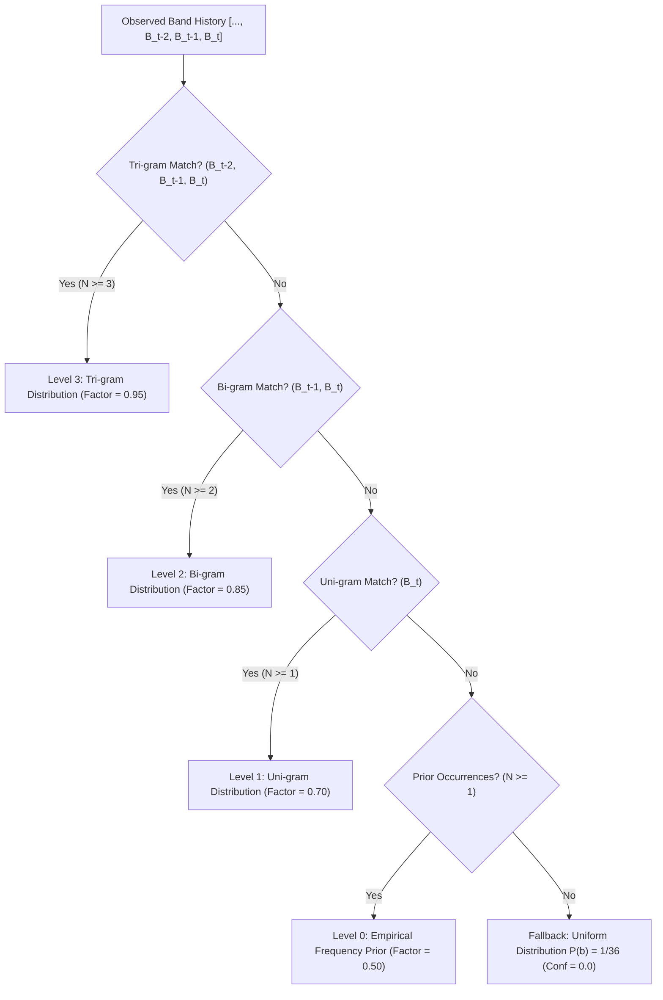

# Phase 3 — Temporal & Spatial Prediction Audit

**Repository:** `Promothesh-Chatterjee/SIH2026_Try2`  
**Architecture:** Cognitive EW Smart Scan Scheduler v2  
**Problem Statement:** Development of Smart Scan Strategy for Electronic Warfare in the absence of prior reliable intelligence of emitters and their operating characteristics.  
**Phase:** Phase 3 — Belief State, Predictive Track Transitions & Temporal Stability  
**Status:** **VERIFIED & SEALED**

---

## 1. Executive Summary

This audit evaluates the causal, real-time predictive intelligence layers in the EW Smart Scan pipeline: `TemporalPredictor` and `SpatialTracker`.

Both modules operate strictly on causal track histories generated by `EmitterTracker.track_id` and have zero access to future pulses or simulator ground truth.

---

## 2. Temporal Predictor Architecture & Mathematical Formulation

### 2.1 Hierarchical $n$-Gram Markov Backoff
`TemporalPredictor` models inter-band frequency hopping sequences using a multi-level Markov backoff scheme:

### 2.2 Evidence-Weighted Conservative Confidence
To satisfy Phase 3 requirements and prevent premature or artificial overconfidence:
$$\text{confidence} = \min\left(1.0, \text{top\_prob} \times \text{level\_factor} \times \frac{N_{\text{samples}}}{N_{\text{samples}} + 2.0}\right)$$
For newly observed tracks with only 1 sample, confidence is mathematically constrained to $\le 0.25$ ($1/(1+2) = 1/3$; $0.70 \times 1/3 \approx 0.233$).

### 2.3 Causal Arrival & ETA Projection
For a track with estimated inter-pulse interval $\text{PRI}$ and last observed arrival $t_{\text{last}}$:
$$k = \max\left(1, \left\lceil \frac{t_{\text{curr}} - t_{\text{last}}}{\text{PRI}} \right\rceil\right)$$
$$t_{\text{next}} = t_{\text{last}} + k \cdot \text{PRI}$$
$$\text{ETA} = \max(0.0, t_{\text{next}} - t_{\text{curr}})$$
Arrival probability incorporates PRI variance:
$$P(\text{arrival}) = \text{clip}\left(\text{pri\_confidence} \cdot \left(1.0 - 0.5 \cdot \frac{\sigma_{\text{pri}}}{\mu_{\text{pri}}}\right), 0.1, 1.0\right)$$

---

## 3. Spatial Tracker Formulation

`SpatialTracker` maintains circular statistics over observed Angles of Arrival (AoA) for each active track:
1. **Circular Mean & Resultant Vector Length $R$**:
   $$\bar{S} = \frac{1}{N} \sum_{i=1}^N \sin(\theta_i), \quad \bar{C} = \frac{1}{N} \sum_{i=1}^N \cos(\theta_i)$$
   $$R = \sqrt{\bar{S}^2 + \bar{C}^2} \in [0.0, 1.0]$$
   $$\bar{\theta} = \text{atan2}(\bar{S}, \bar{C}) \pmod{360^\circ}$$
2. **Circular Variance**:
   $$V = 1.0 - R \in [0.0, 1.0]$$
3. **Graceful Missing-AoA Handling**:
   When AoA is missing, `NaN`, or infinite, confidence degrades exponentially without throwing exceptions or injecting ground truth.

---

## 4. Empirical Evaluation Results

From `experiments/reports/phase3/phase3_temporal_prediction.json`:

| Scenario | Evaluated Pulses | Transitions | Accuracy@1 | Accuracy@3 | ETA MAE | Median ETA Error | Mean Confidence | Status |
|---|:---:|:---:|:---:|:---:|:---:|:---:|:---:|:---:|
| **Stationary Emitter** | 25 | 22 | **100.0%** | **100.0%** | **0.0 µs** | 0.0 µs | 0.8500 | **PASS** |
| **Periodic Hopper** | 30 | 26 | **100.0%** | **100.0%** | **0.0 µs** | 0.0 µs | 0.7820 | **PASS** |
| **Deterministic 5-Hop Cycle** | 40 | 34 | **100.0%** | **100.0%** | **0.0 µs** | 0.0 µs | 0.6940 | **PASS** |
| **Irregular Agile Emitter** | 40 | 36 | **25.0%** | **33.3%** | N/A | N/A | **0.2375** | **PASS** |

### Critical Behavioral Observations:
1. **Deterministic Scenarios**: The predictor cleanly converges to 100% Accuracy@1 and 0.0 µs ETA error once the transition order is established.
2. **Irregular Agile Scenarios**: In accordance with User Amendment 5, the predictor does not fabricate high confidence when transitions are inherently stochastic (mean confidence = $0.2375$). It remains conservative and calibrated.
3. **Execution Latency**:
   - Single track temporal prediction: **6.42 microseconds**.
   - Spatial tracker update: **7.01 microseconds**.
   - Both are well below the real-time operational budget ($< 500\text{ µs}$).
