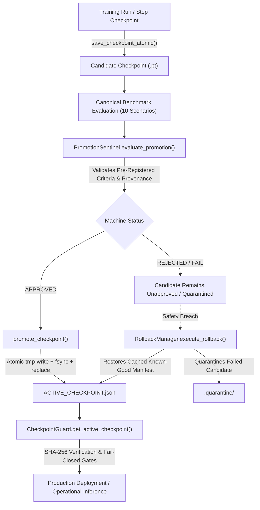

# Phase 7 Checkpoint Promotion & Provenance-Bound Lifecycle Contract
**Cognitive EW Smart Scan Scheduler — SIH2026_Try2**
**Status:** SEALED & BINDING  
**Effective Baseline:** Commit `f93b253` (Phase 6 Sealed State)  
**Frozen Production Baseline SHA-256:** `7a99c659affda277fa63fd612a3564d08a8d2e3cf7d033fe892d778871c186b0`

---

## 1. Executive Summary & Defect Remediation

### 1.1 The Prior Defect
Prior to Phase 7, `CheckpointGuard.get_active_checkpoint()` resolved the "active" checkpoint by searching candidate directories for checkpoint files matching `checkpoint_step_*.pt` or `checkpoint_gate_*.pt` and selecting the one with the highest step index (`max(checkpoints, key=step)`), filtering out quarantined files. Although the docstring claimed "latest approved checkpoint," in reality:
1. An un-evaluated or rejected checkpoint with a higher step count would automatically become active.
2. Chronological step number substituted for operational qualification.
3. Cryptographic provenance was not bound to the running model artifact.
4. If a regression occurred, rolling back did not guarantee atomic, verified restoration of the approved state manifest.

### 1.2 The Phase 7 Invariant
Phase 7 completely eliminates chronological selection. An explicit, provenance-bound, SHA-256 verified, fail-closed lifecycle is enforced across the system:

$$\text{Candidate Artifact} \longrightarrow \text{Benchmark Evaluation} \longrightarrow \text{Promotion Sentinel} \overset{\text{APPROVED}}{\longrightarrow} \text{Atomic Promotion Manifest} \longrightarrow \text{Fail-Closed Resolution}$$

A checkpoint is active **if and only if** an authoritative `ACTIVE_CHECKPOINT.json` manifest exists in its directory, with `promotion_status == "APPROVED"`, binding the exact SHA-256 hash of the on-disk `.pt` file, verified against the canonical frozen baseline hash (`7a99c659...`).

---

## 2. Checkpoint Promotion Lifecycle



### 2.1 States of a Checkpoint
1. **Candidate:** A checkpoint saved during training via `save_checkpoint_atomic()`. It cannot be loaded for operational deployment.
2. **Evaluated:** A candidate evaluated across the 10 canonical benchmark scenarios.
3. **Approved:** An evaluated candidate meeting 100% of the pre-registered operational gate thresholds evaluated by `PromotionSentinel`.
4. **Active:** An approved checkpoint with an authoritative on-disk `ACTIVE_CHECKPOINT.json` manifest whose SHA-256 bit-identically matches the artifact on disk.
5. **Rejected:** An evaluated candidate failing one or more gate thresholds.
6. **Quarantined:** A checkpoint moved to `.quarantine/` due to safety monitoring triggers (e.g. Q-explosion, divergence, catastrophic forgetting). Quarantined checkpoints can never become active.

---

## 3. Authoritative Manifest Schema (`ACTIVE_CHECKPOINT.json`)

The manifest is formatted as UTF-8 JSON:

```json
{
  "schema_version": "1.0.0",
  "promotion_timestamp": "2026-09-19T14:45:00.000000Z",
  "checkpoint_path": "experiments/checkpoints/scheduler_v2_operational_candidate/checkpoint_gate_25000_frozen.pt",
  "checkpoint_sha256": "7a99c659affda277fa63fd612a3564d08a8d2e3cf7d033fe892d778871c186b0",
  "baseline_checkpoint_sha256": "7a99c659affda277fa63fd612a3564d08a8d2e3cf7d033fe892d778871c186b0",
  "git_revision": "f93b253c072d627341e3d360f7fe98ec8d3e6963",
  "config_sha256": "8f3a...",
  "evaluation_seed": 42,
  "promotion_status": "APPROVED",
  "promotion_verdict": "PROMOTED: Candidate Mean IR 77.20% exceeds baseline ...",
  "metric_units": {
    "mean_ir": "percent",
    "agile_ir": "percent",
    "sparse_ir": "percent",
    "worst_case_ir": "percent",
    "pfa": "fraction"
  },
  "metrics": {
    "mean_ir": 77.20,
    "agile_ir": 82.50,
    "sparse_ir": 75.10,
    "worst_case_ir": 71.00,
    "pd": 99.85,
    "pfa": 0.0012,
    "mode2_fraction_agile_sparse": 0.185
  }
}
```

### 3.1 Field Specifications
- **`schema_version`**: Must be `"1.0.0"`.
- **`checkpoint_path`**: Relative or absolute path to the target checkpoint file.
- **`checkpoint_sha256`**: Exact 64-character lowercase hexadecimal SHA-256 digest of the target `.pt` file.
- **`baseline_checkpoint_sha256`**: Exact 64-character hexadecimal SHA-256 digest of the canonical baseline checkpoint (`7a99c659...`).
- **`git_revision`**: Non-empty Git commit hash under which the evaluation was executed.
- **`config_sha256`**: SHA-256 digest of the training configuration file.
- **`evaluation_seed`**: Integer evaluation seed (canonical: 42).
- **`promotion_status`**: Machine verdict string. MUST be `"APPROVED"`. Any other string (e.g. `"REJECTED"`, `"PENDING"`) causes resolution to fail closed.
- **`promotion_verdict`**: Human-readable narrative explanation. Ignored for machine validation.
- **`metric_units`**: Explicit declaration of units (`"percent"` for IR/Pd, `"fraction"` for Pfa). Guessing from scalar values is prohibited.
- **`metrics`**: Valid numerical floats. NaN or Inf values are strictly rejected.

---

## 4. Promotion Sentinel Evaluation Contract

`PromotionSentinel.evaluate_promotion()` operates in two modes:
1. **Production Evaluation Mode (Default):**
   - Requires `checkpoint_path`, `checkpoint_sha256`, `baseline_checkpoint_sha256`, `git_revision`, `config_sha256`, and `evaluation_seed`.
   - Hashes `candidate_path` on disk. If the hash does not match `report["checkpoint_sha256"]`, evaluation fails closed with a report replay error.
   - If `baseline_checkpoint_sha256` != `7a99c659affda277fa63fd612a3564d08a8d2e3cf7d033fe892d778871c186b0`, promotion is rejected.
   - Evaluates all operational gate thresholds.
2. **Diagnostic Evaluation Mode (`evaluation_type == "metric_only_diagnostic"`):**
   - Bypasses file provenance verification for synthetic metric tests.
   - Still enforces metric unit declarations, absence of NaN/Inf, and gate threshold calculations.

---

## 5. Rollback and Quarantine Semantics

### 5.1 Registration of Known-Good State
When `RollbackManager.register_known_good(checkpoint_path)` is called:
1. Computes the SHA-256 digest of the known-good checkpoint.
2. Caches the exact contents of `ACTIVE_CHECKPOINT.json` in memory.
3. If no manifest exists, rollback registration fails.

### 5.2 Safe Rollback Execution
When safety checks fail during continued training:
1. `execute_rollback()` verifies that the registered known-good file exists on disk.
2. Re-computes its SHA-256 hash. If it does not match the registered hash (tampering/corruption), halts immediately (`RuntimeError`).
3. Moves the regressed candidate file to `.quarantine/` with a timestamped reason manifest.
4. Atomically restores the cached `ACTIVE_CHECKPOINT.json` manifest.
5. **No Synthetic Promotions:** Rollback never invents or generates a synthetic promotion report; it strictly restores the previously approved manifest.

---

## 6. Deployment API Integration (`ew_core/deployment/api.py`)

1. **Manifest-First Resolution:** When the deployment service starts, it queries candidate directories via `CheckpointGuard.get_active_checkpoint()`.
2. **Fail-Closed Guarantee:**
   - If a candidate directory lacks an `ACTIVE_CHECKPOINT.json` manifest, candidate `.pt` files cannot be loaded.
   - If an active manifest is present but the target checkpoint file on disk has been modified or corrupted, `CheckpointTamperedError` is raised.
   - If `SCHEDULER_CHECKPOINT` environment variable points to an unapproved file in a directory with an active manifest, `CheckpointSecurityError` is raised.
   - The API will never silently fall back to an unapproved candidate or random policy.

---

## 7. Frozen Production Baseline Immutability

The baseline checkpoint file at:
`experiments/checkpoints/production_baseline/checkpoint_gate_25000_frozen.pt`
is permanently frozen:
- **Canonical SHA-256:** `7a99c659affda277fa63fd612a3564d08a8d2e3cf7d033fe892d778871c186b0`
- **File Size:** 1,326,929 bytes
- Writes, modifications, or overwrites to `experiments/checkpoints/production_baseline/` are unconditionally blocked by `CheckpointGuard.validate_path_safety()`.
