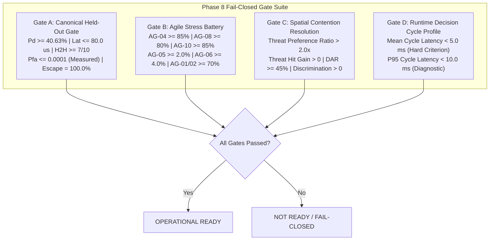

# Phase 8 Operational Readiness Gate Contract
**Cognitive EW Smart Scan Scheduler — SIH2026_Try2**

## 1. Executive Summary & Purpose

Phase 8 formalizes the operational-readiness gate system so that `OPERATIONAL READY` strictly adheres to `docs/BENCHMARK_PROTOCOL.md`. It eliminates threshold drift, masked metrics, NaN/Inf acceptance, legacy checkpoint paths, incomplete gate evaluation, false passes, and conflated liveness/readiness states.

Under Phase 8:
- An operational verdict is **fail-closed**: any missing, non-finite, improperly typed, or sub-threshold metric unconditionally triggers gate failure.
- Operational checkpoint loading is **provenance-bound**: the operational model must resolve via `CheckpointGuard` and match the approved active manifest.
- Deployment readiness is **10-dimensional**: the `/health` endpoint validates 10 independent operational prerequisites and reports detailed blocker diagnostics.
- Zero neural network retraining: the frozen baseline weights (`7a99c659affda277fa63fd612a3564d08a8d2e3cf7d033fe892d778871c186b0`) remain immutable.

---

## 2. Four Operational Readiness Gates (Gates A–D)

All operational readiness evaluations must assess all four formal gates. Partial evaluations or skipping gates is prohibited.

### 2.1 Gate A: Canonical Held-Out Validation Suite
- **Input Data**: 10 canonical held-out real-world TSRD radar datasets (`config_117`, `config_119`, `config_143`, `config_194`, `config_195`, `config_241`, `config_29`, `config_42`, `config_64`, `config_96`), 1,000 dwell steps each (10,000 total steps).
- **Metric Definitions & Targets**:
  | Metric | Unit | Target | Fail-Closed Condition |
  | :--- | :--- | :--- | :--- |
  | **Canonical Intercept Rate ($P_d$)** | Dimensionless / Pct | $\ge 40.63\%$ ($4,063$ hits) | Fail if $< 0.4063$, missing, or non-finite |
  | **Median Intercept Latency** | Microseconds ($\mu\text{s}$) | $\le 80.0\ \mu\text{s}$ (v2: $76.7\ \mu\text{s}$ vs RR $83.3\ \mu\text{s}$) | Fail if $> 80.0$, NaN, Inf, or missing |
  | **Head-to-Head vs Round-Robin** | Wins / Scenarios | $\ge 7 / 10$ wins | Fail if $< 7$ wins |
  | **Measured False Alarm Rate ($P_{\text{fa}}$)** | Rate / Dwells | $\le 0.0001$ | Measured directly from FoM; fail if $> 0.0001$ or hardcoded 0.0 |
  | **Empty-Band Escape Rate** | Percentage | $= 100.0\%$ ($\ge 99.99\%$) | Fail if $< 99.99\%$ or missing |

### 2.2 Gate B: Agile Stress Battery (AG-01 to AG-10)
- **Input Scenarios**: 10 synthetic frequency-agile radar emitters spanning cyclic hopping, fast agility, slow hoppers, Markov transitions, and multi-emitter dense EW.
- **Metric Definitions & Targets**:
  | Scenario ID | Emitter Profile | Target ($P_d$ / Mean IR) | Role |
  | :--- | :--- | :--- | :--- |
  | `AG-04` | Fast Agile Hopper ($100\ \mu\text{s}$ PRI) | $\ge 85.0\%$ | Primary High-Agility Non-Inferiority |
  | `AG-08` | Hybrid Fixed + Agile Hopper | $\ge 80.0\%$ | Surveillance + Agility Non-Inferiority |
  | `AG-10` | Complex Dense Multi-Emitter EW | $\ge 85.0\%$ | Multi-Threat Non-Inferiority |
  | `AG-05` | Slow Agile Hopper ($800\ \mu\text{s}$ PRI) | $\ge 2.0\%$ | Demonstrated Lift over $1.6\%$ baseline |
  | `AG-06` | Markov 1st-Order Hopper ($220\ \mu\text{s}$ PRI) | $\ge 4.0\%$ | Demonstrated Lift on Stochastic Agility |
  | `AG-01` | 3-Band Cyclic Hopper ($250\ \mu\text{s}$ PRI) | $\ge 70.0\%$ | Agile Class Floor |
  | `AG-02` | 4-Band Cyclic Hopper ($300\ \mu\text{s}$ PRI) | $\ge 70.0\%$ | Agile Class Floor |

### 2.3 Gate C: Spatial Contention Resolution
- **Input Scenario**: Overlapping frequency co-channel emitters with disparate Angle-of-Arrival (threat vs. benign).
- **Metric Definitions & Targets**:
  | Metric | Requirement | Objective |
  | :--- | :--- | :--- |
  | **Threat Preference Ratio (Enabled)** | $> 2.0\times$ | Prioritize lethal coherent threat over diffuse benign emitters |
  | **Preference Shift** | Enabled $>$ Disabled | Demonstrated positive steering benefit from AoA tracking |
  | **Threat Hit Gain** | $> 0$ net hits | Increased absolute threat intercepts under contention |
  | **Decision Alteration Rate (DAR)** | $\ge 45.0\%$ | Substantive cognitive arbitration override rate |
  | **Target Discrimination Gain** | $> 0.0$ | Verifiable selection accuracy improvement under co-channel overlap |

### 2.4 Gate D: Runtime Decision Cycle Latency
- **Input Scenario**: End-to-end operational software-in-the-loop (SIL) pipeline execution profiling across 1,000 cycles: PDW ingest $\to$ temporal prediction $\to$ neural evaluation $\to$ cognitive arbitration $\to$ tuner command formatting.
- **Metric Definitions & Targets**:
  | Metric | Type | Target | Note |
  | :--- | :--- | :--- | :--- |
  | **Mean Cycle Latency** | **Hard Criterion** | $< 5.0\ \text{ms}$ | Must strictly meet real-time scanning budget |
  | **P95 Cycle Latency** | **Diagnostic Tail** | $< 10.0\ \text{ms}$ | Tail latency diagnostic check |
  | **Profile Metrics** | Reporting | Mean, Median, P95, P99, Max | Complete cycle latency distribution reported |

---

## 3. Checkpoint Governance & Integrity Protocol

### 3.1 Provenance-Bound Checkpoint Resolution
- Gate runners and backend deployment must resolve checkpoints exclusively through `CheckpointGuard`:
  `CheckpointGuard("experiments/checkpoints/scheduler_v2_operational_candidate").get_active_checkpoint()`
- If a user specifies an explicit `--checkpoint` argument:
  1. The target path must resolve bit-identically to the active approved checkpoint in `ACTIVE_CHECKPOINT.json`.
  2. The SHA-256 digest of the target file must match the active manifest digest.
  3. If unapproved, quarantined, or tampered, the system fails closed immediately with `ReadinessStatus.INTEGRITY_FAILURE` and exit code 1.

### 3.2 Canonical Baseline Invariance
- Pinned Baseline SHA-256: `7a99c659affda277fa63fd612a3564d08a8d2e3cf7d033fe892d778871c186b0`.
- Baseline directory `experiments/checkpoints/production_baseline/` is write-forbidden under all circumstances.

---

## 4. Production Deployment `/health` Endpoint Contract

### 4.1 Ten Operational Prerequisites
The `/health` endpoint evaluates ten independent operational prerequisites:

1. `scheduler_loaded`: Neural scheduler policy resident in memory.
2. `deinterleaver_loaded`: PDW deinterleaver transformer resident in memory.
3. `controller_ready`: Operational receiver controller initialized.
4. `dimension_check_passed`: Observation vector verified at 360-D.
5. `normalization_hash_match`: Input normalization hash matches expected manifest.
6. `hidden_state_ready`: DRQN recurrent hidden state initialized.
7. `active_model`: Active approved model designation present and non-empty.
8. `checkpoint_sha256`: Cryptographic SHA-256 matches verified active checkpoint.
9. `policy_mode`: Policy mode equals `"operational"` (deterministic execution).
10. `exploration_enabled`: Exploration is `False` (zero stochastic exploration in production).

### 4.2 HTTP Status Code Semantics
- **HTTP 200 OK**: Returned if and only if **all 10 prerequisites pass** (`operational_mode_ready = True`, `status = "ok"`).
- **HTTP 503 Service Unavailable**: Returned if **any prerequisite fails** (`operational_mode_ready = False`, `status = "degraded"`).
- Detailed failure descriptions are returned in `HealthResponse.readiness_failures`.
- `operational_mode_ready` is decoupled from `is_mission_active`: an idle mission controller with verified models is operational-ready.

---

## 5. Scope Boundaries

1. **Software-in-the-Loop (SIL) Timing Scope**: Latency budgets apply to software decision cycle processing time (ingest, neural evaluation, arbitration, tuning commands). Physical RF synthesizer lock times and analog front-end switching transients are evaluated under modeled simulation contracts ($15.0\ \mu\text{s}$ retune delay).
2. **Zero Retraining Invariant**: Phase 8 modifies only validation, evaluation, gate runners, deployment verification, and contract enforcement logic. Neural network weights remain bit-exact.
